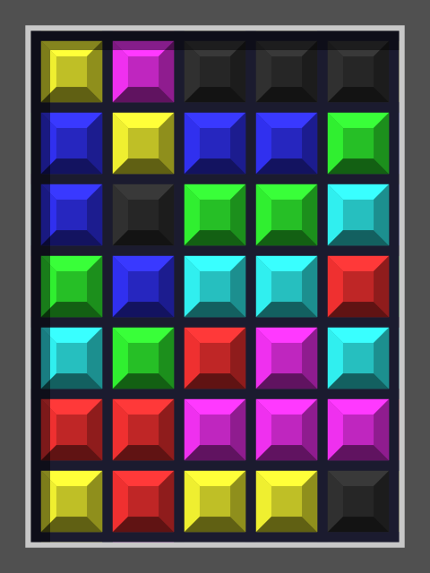

# Torus Sliding Puzzle

Repository for experimenting with the torus sliding puzzle, inspired on the 1992 Cogito game by Kalisto

This repository contains 3 programs: a puzzle generator, a solver that uses IDA* to find the shortest solution to the puzzle, and a GTK+3 interface to visualize the solution. 

All three programs are written in C, and were written and tested on Ubuntu/WSL2.

## How the puzzle works

Given a H x W grid with colored cells, the player must shift cells along rows or columns to reach the desired configuration. Cells that go out of the board appear on the other side. For example:

<p align="center">
  
&nbsp; &nbsp; &nbsp; &nbsp;
  
</p>

We have the starting configuration on the left, and the goal on the right. A solution would be as follows:

<p align="center">
  
  <br/>
</p>

# Requirements

You may need to install GTK+3 if you want to run the visualizer. In Ubuntu, run

``` sh
sudo apt install libgtk-3-dev
```

The generator also uses LibPNG to load the images. In Ubuntu, run

``` sh
sudo apt install libpng-dev
```

# Compiling and running

To compile everything, just run

``` sh
make
```

## Generator

The generator program generates a puzzle and outputs it to the standard output. 

It has 2 modes: generate from scratch, and generate from an image. 

To generate a puzzle from scratch, run

``` sh
./generator <seed> <entropy> <height> <width>
```

Parameter | Description
---|---
seed|the random seed for the puzzle generation. use same seed to replicate results
entropy | how many random moves should be applied to generate the puzzle. correlates with how many steps are required to solve the puzzle.
height | puzzle height, less than 64
width | puzzle width, less than 64

The generator will create a grid of the specified size, filling each row with one color, up to 8 different colors. Then it will apply random movements to generate the initial configuration. For example,

``` sh
./generator 123987 12 5 5
```

yields the following puzzle, with the starting configuration on the left and the goal on the right:

<p align="center">
  
&nbsp; &nbsp; &nbsp; &nbsp;
  
</p>

To generate a puzzle from an image, run

``` sh
./generator <seed> <entropy> -i <image>
```

Parameter | Description
---|---
seed|the random seed for the puzzle generation. use same seed to replicate results
entropy | how many random moves should be applied to generate the puzzle. correlates with how many steps are required to solve the puzzle.
image | path to a .png image. Both width and height must be less than 64, and the image must have less than 8 colors.

The `templates` folder contains some .png images you can try.

For example, 

``` sh
./generator 190102 5 -i templates/mario.png
```

yields the following puzzle, with the starting configuration on the left and the goal on the right:

<p align="center">
  
&nbsp; &nbsp; &nbsp; &nbsp;
  
</p>


## Solver

The solver program, dubbed `untangle`, takes a puzzle from standard input and outputs the solution to a `output.txt`. It will also open the visualizer and animate the solution, unless the `-s` flag is specified.

To run it, call 

``` sh
./untangle [-s] < <input> 
```

or directly chain it with the generator:

``` sh
./generator (...) | ./untangle [-s] 
```

For example: 

```sh
./generator 19002 22 -i templates/cogito.png | ./untangle
```

yields the following: 
<p align="center">
  
  <br/>
</p>

Happy solving!
